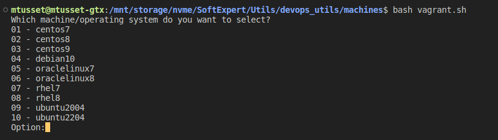
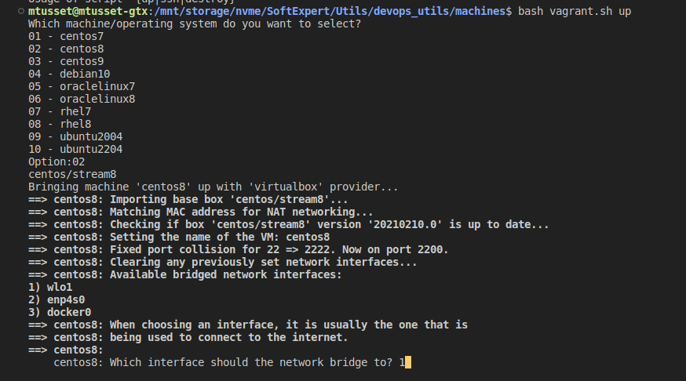

# Provisionamento de Máquinas Virtuais Linux com Vagrant
Se você usa sistema operacional linux como área de trabalho, deve-se usar o script vagrant.sh para gerenciar suas máquinas virtuais. 

Sendo assim, segue abaixo tutorial de uso e das dependências necessárias:

## Sistemas Operacionais Disponíveis para Provisionamento
- Centos 7
- Centos 8 Stream
- Centos 9 Stream
- Debian 10
- Oracle Linux 7
- Oracle Linux 8
- RedHat Enterprise Linux 7
- RedHat Enterprise Linux 8
- Ubuntu 20.04
- Ubuntu 22.04

## Dependências
1. Instalar Vagrant: https://developer.hashicorp.com/vagrant/downloads
2. Instalar plugin vagrant-disksize no Vagrant `vagrant plugin install vagrant-disksize`

## Provisionando máquina virtual:
**Nesse caso de uso, estamos usando o virtualbox como provedor das máquinas virtuais**

1. Acesse o diretório que contém o script vagrant.sh (caso ainda não tenha acessado):
```shell
cd machines/
```

2. Rode o comando para escolher o sistema operacional da máquina virtual que deseja provisionar:
```shell
bash vagrant.sh up
```

3. O script irá questionar pedindo o número do sistema operacional desejado, assim, deve-se informar conforme a lista de opcões:



4. Nesse exemplo informaremos o número 02 para teste.

5. Após feito o passo 4, o script irá pedir qual a interface de rede desejada para o adaptador bridge da máquina virtual, escolha o de sua preferência:



5. Após informado o adaptador de rede, a máquina virtual será criada.

## Acessando a máquina virtual via ssh

1. Após criada a máquina virtual, pode-se conectar na mesma via ssh, assim comecamos novamente executando o script vagrant.sh
```shell
cd machines/
bash vagrant.sh ssh
```

2. Ao executar o script, informe o número do sistema operacional o qual se refere a máquina que você deseja conectar.

3. Após informado, pressione enter e o script conectará automaticamente via ssh na sua máquina virtual.

## Destruindo a máquina virtual

1. Para destruir uma máquina virtual com vagrant, deve-se rodar novamente o script vagrant.sh conforme abaixo:
```shell
cd machines/
bash vagrant.sh destroy
```

2. Selecione o número do sistema operacional desejado o qual se refere a máquina virtual criada.

3. Após informado, confirme a remocão com `y`, feito isso, o vagrant irá remover a máquina virtual